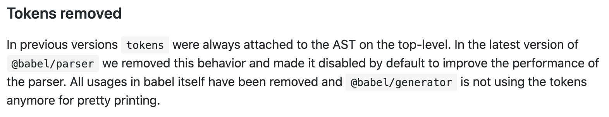
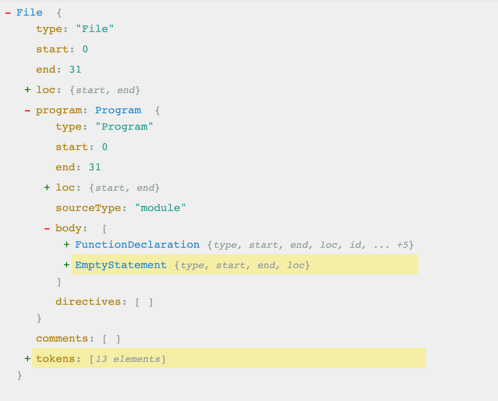

# babel 解析

在工作我们对babel的了解可能就是在 `webpack`中配置的 `babel-loader`，而对于babel在其中做了一些什么事情，怎么做的可能不是很了解，同时对于一些概念比如 `ast`等也比较模糊，本篇文章尝试对 `babel`内部做的事情解析一下。

## 1. babel基本概念及api

babel是什么，按照官方说法，babel是一个javascript翻译器。他可以将 `ECMAScript2015+`版本的代码转换为向后兼容的 `Javascript`语法，以便能够运行在当前和旧版本的浏览器或其他环境中。

简单说，babel提供了代码转换的能力，你给babel提供一些代码，babel对这些代码更改后，再返回给你新生成的代码。

### 1.1 ast

`ast`全称抽象语法树(Abstract Syntax Tree)，看名字不好理解，实际上就是用一个树状结构的对象来描述我们写的代码，babel对于代码的转换操作就是基于对 `ast`的操作。在[astexplorer](https://astexplorer.net/)这个网站上可以看到将代码转换成的ast：

有如下函数：

```js
function square(n) {
  return n * n;
}
```

经转换后生成的ast结果如下：

```js
{
  "type": "Program",
  "start": 0,
  "end": 38,
  "body": [
    {
      "type": "FunctionDeclaration",
      "start": 0,
      "end": 38,
      "id": {
        "type": "Identifier",
        "start": 9,
        "end": 15,
        "name": "square"
      },
      "expression": false,
      "generator": false,
      "async": false,
      "params": [
        {
          "type": "Identifier",
          "start": 16,
          "end": 17,
          "name": "n"
        }
      ],
      "body": {
        "type": "BlockStatement",
        "start": 19,
        "end": 38,
        "body": [
          {
            "type": "ReturnStatement",
            "start": 23,
            "end": 36,
            "argument": {
              "type": "BinaryExpression",
              "start": 30,
              "end": 35,
              "left": {
                "type": "Identifier",
                "start": 30,
                "end": 31,
                "name": "n"
              },
              "operator": "*",
              "right": {
                "type": "Identifier",
                "start": 34,
                "end": 35,
                "name": "n"
              }
            }
          }
        ]
      }
    }
  ],
  "sourceType": "module"
}
```

经过精简后，只看它的主体结构：

```js
{
  "type": "Program",
  "body": [
    {
      "type": "FunctionDeclaration",
      "id": {
        "type": "Identifier",
        "name": "square"
      },
      "params": [
        {
          "type": "Identifier",
          "name": "n"
        }
      ],
      "body": {
        "type": "BlockStatement",
        "body": [
          {
            "type": "ReturnStatement",
            "argument": {
              "type": "BinaryExpression",
              "left": {},
              "operator": "*",
              "right": {}
            }
          }
        ]
      }
    }
  ]
}
```

可以发现，每个块(使用对象表示的部分)都包含一个 `type`属性，值包含这些：

- Program：顶层的代码描述
- FunctionDeclaration：函数的声明描述
- Identifier：变量声明描述
- BinaryExpression：表达式声明
- ReturnStatement：`returen` 标识符描述

[点击查看所有type类型声明](https://babeljs.io/docs/en/babel-types)

看名称，我们大概可知道这些是用来描述函数各个部分的类型。

除了 `type`属性，会根据type属性的不同值，在各个块中还其他的属性：

- FunctionDeclaration:

```js
{
  id: '',
  params: [{}],
  body: {}
}
```

- BinaryExpression:

```js
{
  type: "BinaryExpression",
  left: {},
  operator: "*",
  right: {}
}
```

所有，每个不同的块由于 `type`值的不同，会有其他不同属性来描述这个块。**事实上，在babel中，每个块表示为节点(Node)，也就是一个对象，这些描述节点的对象组成的一个嵌套结构的大对象可称为 `ast`**

## 2. babel 转换代码的步骤

babel的对代码的转换是基于对 `ast`的操作，babel的转换过程主要是三个步骤：

1. parse：解析，将code解析成ast的过程
2. traverse：遍历，遍历ast，对节点执行修改、添加、删除等操作，同时babel插件也是作用于这个步骤
3. generator：生成，将修改后新的ast再生成代码

由此可见，babel做的工作就是 `code => ast => code` 的过程，下面分别再看这三个步骤的执行过程

### 2.1 parse

首先是 `parse`，将代码转换成 `ast`的过程。babel7之后使用 `@babel/parser`这个库做解析，在babel7前使用 `babylon`作为解析库，7之后将 `babylon`作为了 `babel`的子库。

还有一个区别是，babel7之前的解析阶段分为两个步骤，**词法分析（Lexical Analysis）** 和 **语法分析（Syntactic Analysis）**

1. 词法分析

词法分析阶段是把代码转换成一个个的 **令牌(Tokens)流**，所谓的令牌流可以理解为一个扁平的语法片段数组：

```js
n * n
```
上面的代码得到的令牌流：

```js
[
  { type: { ... }, value: "n", start: 0, end: 1, loc: { ... } },
  { type: { ... }, value: "*", start: 2, end: 3, loc: { ... } },
  { type: { ... }, value: "n", start: 4, end: 5, loc: { ... } },
  ...
]
```
其中的每个对象元素就是对于 `token`的描述，其中type字段也包含了其他的信息来描述该token：

```js
{
  type: {
    label: 'name',
    keyword: undefined,
    beforeExpr: false,
    startsExpr: true,
    rightAssociative: false,
    isLoop: false,
    isAssign: false,
    prefix: false,
    postfix: false,
    binop: null,
    updateContext: null
  },
  ...
}
```

2. 语法分析

语法分析阶段是将得到的令牌流转换成ast的过程。这个阶段会使用令牌中的信息把它们转换成一个 AST 的表述结构，这样更易于后续的操作。

以上是babel7之前的parse的过程，然后在babel7之后，将code转化成tokens的过程取消掉了：



```js
const parser = require("@babel/parser");

const code = `function square(n) {
  return n * n;
}`;

let ast = parser.parse(code, { sourceType: 'module', plugins: ['jsx'] });
console.dir(ast, { depth: null })
```
在上面代码中，给 `parser.parse`方法传递字符串格式的函数，执行后会返回一个 `ast`，这里只截取其中主要内容部分

```js
Node {
  type: 'File',
  start: 0,
  end: 38,
  loc: SourceLocation {
    start: Position { line: 1, column: 0 },
    end: Position { line: 3, column: 1 },
  },
  program: Node {
    type: 'Program',
    start: 0,
    end: 38,
    loc: SourceLocation {
      start: Position { line: 1, column: 0 },
      end: Position { line: 3, column: 1 },
      filename: undefined,
      identifierName: undefined
    },
    sourceType: 'module',
    body: [
      Node {
        type: 'FunctionDeclaration',
        start: 0,
        end: 38,
        loc: SourceLocation {
        },
        id: Node {
          type: 'Identifier',
          loc: SourceLocation {
            identifierName: 'square'
          },
          name: 'square'
        },
        generator: false,
        async: false,
        params: [
          Node {
            type: 'Identifier',
            start: 16,
            end: 17,
            loc: SourceLocation {
              start: Position { line: 1, column: 16 },
              end: Position { line: 1, column: 17 },
              identifierName: 'n'
            },
            name: 'n'
          }
        ],
        body: Node {
          type: 'BlockStatement',
          start: 19,
          end: 38,
          loc: SourceLocation {
            start: Position { line: 1, column: 19 },
            end: Position { line: 3, column: 1 },
          },
          body: [
            Node {
              type: 'ReturnStatement',
              start: 23,
              end: 36,
              loc: SourceLocation {
                start: Position { line: 2, column: 2 },
                end: Position { line: 2, column: 15 },
              },
              argument: Node {
                type: 'BinaryExpression',
                start: 30,
                end: 35,
                loc: SourceLocation {
                  start: Position { line: 2, column: 9 },
                  end: Position { line: 2, column: 14 },
                },
                left: Node {
                  type: 'Identifier',
                  start: 30,
                  end: 31,
                  loc: SourceLocation {
                    identifierName: 'n'
                  },
                  name: 'n'
                },
                operator: '*',
                right: Node {
                  type: 'Identifier',
                  loc: SourceLocation {
                    identifierName: 'n'
                  },
                  name: 'n'
                }
              }
            }
          ],
        }
      }
    ]
  }
}
```
生成的ast的具体的字段名称这里就不再解释了，其中的字段比较多，我们只需要知道的是，这些字段都是对于一个节点的描述，有了这些描述，babel在后面的 `generator` 阶段也就知道如何把这些节点再转换成具体的代码。

[了解 babel-parser](https://www.babeljs.cn/docs/babel-parser)

### 2.2 traverse

在 `parser` 阶段 `babel` 把代码转换成了 `ast`，下个阶段就是执行对ast的遍历操作了，包括对其中节点的添加、删除、修改等操作，这是babel编译过程中最复杂的过程，**同时也是babel插件介入工作的阶段**，比如像 `babel-plugin-react`、`babel-plugin-import`等都是在这个阶段工作。这里还是通过例子来看。

首先安装 `@babel/traverse`

```js
const babylon = require("@babel/parser");
const traverse = require("@babel/traverse").default;

const code = `function square(n) {
  return n * n;
}`;

let ast = babylon.parse(code, { sourceType: 'module', plugins: ['jsx'] });

//====================== 遍历 ==================

const visitor = {
  FunctionDeclaration: function(path) {
    // 操作节点
  },
  Identifier: function(path) {
    // 操作节点
  }
}

traverse(ast, visitor)

console.dir(ast, {depth: null})
```

#### 2.2.1 visitor

可以看到，这里给 `traverse`方法第二个参数传入的是 `visitor`对象，并且其中的两个属性名 `FunctionDeclaration` 和 `Identifier`就是上面提到的ast中的节点的 `type`属性值。

实际上，在对ast的遍历过程中，当遍历到的节点的type类型是 `FunctionDeclaration`，就会调用 `visitor`对象中的 `FunctionDeclaration`方法。称此对象为visitor，这是参考了设计模式中的 `visitor`模式

#### 2.2.2 path

注意到，visitor方法中传入了一个 `path`参数，那这个path参数又是代表什么？

ast通常会有许多的节点，那么节点之间如何相互关联呢？我们可以使用一个可操作和访问的巨大可变对象表示节点之间的关联关系，或者也可以使用 `Paths`来简化这件事情

path表示两个节点之间连接的对象，例如有下面一个节点及其子节点的ast描述：

```js
{
  type: "FunctionDeclaration",
  id: {
    type: "Identifier",
    name: "square"
  },
  ...
}
```

将子节点 `Identifier`表示为一个路径(path)的话，结果如下：

```js
{
  "parent": {
    "type": "FunctionDeclaration",
    "id": {...},
    ....
  },
  "node": {
    "type": "Identifier",
    "name": "square"
  }
}
```

可以看到，实际上将节点 `Identifier`部分包裹在了 `node`字段中，后续对节点的操作需要基于node字段，除了node字段之外，path中还包含其他元数据：

```js
{
  "parent": {...},
  "node": {...},
  "hub": {...},
  "contexts": [],
  "data": {},
  "shouldSkip": false,
  "shouldStop": false,
  "removed": false,
  "state": null,
  "opts": null,
  "skipKeys": null,
  "parentPath": null,
  "context": null,
  "container": null,
  "listKey": null,
  "inList": false,
  "parentKey": null,
  "key": null,
  "scope": null,
  "type": null,
  "typeAnnotation": null
}
```
路径对象会包含对节点的增加、修改、移动、删除等有关的其他方法我们在后面再实践。

某种意义上，路径是一个节点在树中的位置，以及关于该节点各种信息的响应式 **Responsive** 表示。当你调用一个修改树的方法后，路径信息也会被更新，babel帮你管理这一切，从而使得节点操作更简单，尽可能做到无状态。

### 2.3 generator

经过了 `parsser`和 `traverse`阶段，babel在下个阶段就是把修改后的ast树再转换成 `code`，这个阶段就是生成 `generator`。

这里需要使用到 `@babel/generator`

```js
const parser = require("@babel/parser");
const traverse = require("@babel/traverse").default;
const generator = require("@babel/generator").default;

const code = `function square(n) {
  return n * n;
}`;

let ast = parser.parse(code, { sourceType: 'module', plugins: ['jsx'] });

const visitor = {
  FunctionDeclaration: function(path) {
    // 
  },
  Identifier: function(path) {
    path.node.name = "x";
  }
}

traverse(ast, visitor)

// generator 阶段
const result = generator(ast, {
  compact: true
}, code)

console.dir(result, { depth: null });
// 字符串转换成函数
const f = new Function('return ' + result.code)
```

在 `visitor`的`Identifier`函数内，把变量名称转换成了 x，最终生成的新的code结果为：

```js
{
  code: 'function square(x){return x*x;}',
  map: null,
  rawMappings: undefined
}
```

可以发现，得到的新的代码字符串中，把函数的参数名称和变量名称都改成了 `x`，这里开始有点babel插件的样子了。

### 小总结

以上就是babel在进行代码编译过程中做的主要的三个步骤，简单来说就是这个过程：

1. code => ast
2. traverse ast
3. ast => code

generator的过程可以查看[官网](https://www.babeljs.cn/docs/babel-generator)

### 2.4 template

babel提供了一个template的功能，相当于给我们提供了代码模版的功能，对于相似的代码块直接使用模版并注入预置好的变量生成即可，不需要每次都书写相同的代码。在计算机科学中，这种能力被称为准引用(quasiquotes)

```js
const generator = require("@babel/generator").default;
const template = require("@babel/template").default;
const t = require("babel-types");

const buildRequire = template(`
  var IMPORT_NAME = require(SOURCE);
`);

const ast = buildRequire({
  IMPORT_NAME: t.identifier("myModule"),
  SOURCE: t.stringLiteral("my-module")
});

console.log(generator(ast).code); // var myModule = require("my-module");
```

## 3. 编写一个简单插件

有了以上对babel知识的基本了解后，现在再写一个babel插件就是比较轻松的事情了。一个babel插件的基本结构如下：

```js
export default function(babel) {
  const { types:t, template } = babel
  return {
    visitor: {
      Identifier(path, state) {
        // content
      },
    }
  }
};
```
函数解析：

- babel插件就是一个函数，接受一个babel参数
- babel参数中可以解构出 `types`、`template`两个属性，这两个属性前面已经说过了
- 函数返回一个对象，其中visitor对象的函数接受两个参数path和state，state可以接收用户传给插件的参数

有如下函数字符串，现在要做两件事情，第一是修改函数名称为 `foo`，第二是修改函数体，根据不同条件返回不同的结果

```js
const code = "function fn(x){ return x * x };"
```

把这段代码放到[astexplorer](https://astexplorer.net/#/Z1exs6BWMq)中，先得到一个完整的ast树，后续的操作很大部分要参考这棵树的结构：



**3.1** 首先，将函数名称修改为 `foo`， 并将函数参数 `x` 修改为 `n`

```js
module.exports = ({ types: t, template }) => {
  let paramName
  return {
    visitor: {
      Identifier(path, state, scope) {
        console.log("Visiting Identifer: " + path.node.name);
        // 修改参数 及 变量
        if (path.node.name === paramName) { 
          path.node.name = 'n'
        }
        // 翻转 type 为Identifier 的节点name
        // path.node.name = path.node.name.split('').reverse().join('')
      },
      FunctionDeclaration(path, state) {
        path.node.id = t.Identifier('foo')
        // 或者 path.node.id.name = 'foo'
        paramName = path.node.params[0].name
      }
    }
  };
}
```

修改函数名称我们在函数声明 `FunctionDeclaration` 方法中修改，修改的方式有两种':

1. 直接替换node节点：

```js
path.node.id = t.Identifier('foo')
```
此处 `t.Identifier` 定义一个 `type`类型为 `Identifier` 的节点

2. 修改节点的名称

```js
path.node.id.name = 'foo'
```

修改变量名称在变量声明 `Identifier`中操作。在遍历到 `FunctionDeclaration`时，我们保存了原始变量名称到 `paramName`中，遍历到 `Identifier`时候，判断变量名称和原始变量名一致的情况下，将变量名修改为 `n`：

```js
if (path.node.name === paramName) { 
  path.node.name = 'n'
}
```

**3.2** 然后，修改函数体。期望值是在函数体内，加入if判断返回不同的结果，这里有两种做法。

方式一是在 `FunctionDeclaration` 中操作

```js
FunctionDeclaration(path, state) {
  path.node.id = t.Identifier('foo')
  paramName = path.node.params[0].name
  
  const { whenFalse = 'false_statement' } = state.opts
  // 修改函数体
  const buildRequire = template(`
    if (n) {
      BODY_STATEMENT
    } else {
      return ${whenFalse}
    }
  `);
  // 找到 ReturnStatement
  const ReturnStatement = path.node.body.body[0]

  const body_ast = buildRequire({
    BODY_STATEMENT: ReturnStatement,
  });

  path.node.body.body[0] = body_ast
}
```

这种方式就是自上而下，在 `FunctionDeclaration`中找到 `ReturnStatement`，也即是找到函数体中原始的值，并赋值给 `BODY_STATEMENT`，再使用 `template`生成新的 `ast`，替换掉函数体中原始的 `ReturnStatement`

方式二是在 `ReturnStatement`声明中操作：

```js
ReturnStatement(path, state) {

  const { whenFalse = 'false_statement' } = state.opts
  // 修改函数体
  const buildRequire = template(`
    if (n) {
      BODY_STATEMENT
    } else {
      return WHEN_FALSE
    }
  `);
  // 获取当前节点
  const body = path.getSibling(0).node

  const body_ast = buildRequire({
    BODY_STATEMENT: body,
    WHEN_FALSE: t.expressionStatement(t.stringLiteral(whenFalse))
  });
  // path.parentPath.node.body[0] = body_ast // 这么写是可以的
  // 这里加上判断的原因是，修改了path后再次遍历 ReturnStatement 又回创建新的if语句，无限递归执行，造成死循环
  if (t.isFunctionDeclaration(path.parentPath.parentPath.node)) {
    path.replaceWith(body_ast)
  }
},
```

这种方式是当遍历到 `ReturnStatement`，先存储表达式的节点 `const body = path.getSibling(0).node`，然后构建新的节点，最后再判断如果它的上两级父节点是 `FunctionDeclaration`，那么直接使用新节点替换到老节点。这里主要使用了几个新的 api：

- path.getSibling：当一个节点处于容器中，使用此方法可以获取容器中的某个节点，此处 `ReturnStatement`的 `parentPath`是 `BlockStatement`，此容器中可以存储多个子节点。 [Get Sibling Paths](https://github.com/jamiebuilds/babel-handbook/blob/master/translations/en/plugin-handbook.md#get-sibling-paths)
- t.isFunctionDeclaration：判断某个节点的类型。[判断类型](https://github.com/jamiebuilds/babel-handbook/blob/master/translations/en/plugin-handbook.md#check-if-a-node-is-a-certain-type)
- path.replaceWith：替换掉节点本身。[替换](https://github.com/jamiebuilds/babel-handbook/blob/master/translations/en/plugin-handbook.md#replacing-a-node)


**3.3** 最后使用如下方式测试插件：

```js
var babel = require("babel-core");
const myPlugin = require("plugin_path")

var result = babel.transform(code, {
  plugins: [[myPlugin, { whenFalse: 'hhhhh' }]]
});

console.log(result.code, 'result');
```

最终得到的结果如下：

```js
function foo(n) {
  if (n) {
    return n * n;
  } else {
    return 'hhhhhh';
  }
};
```

## 总结

以上对babel的工作流程做了一下梳理，通过上文的分析，我们发现它做的主要工作就是 `code => code` 的过程。并且基于对原理的认识之后，我们实践了一个简单的 `babel-plugin`。当然 `babel`对于代码的处理能力当然远不止如此，一个好的插件往往可以帮我们自动化处理很多需要手动操作的代码，比如上线代码去掉 `console.log`的 `babel-plugin-console`，同时有了 `babel-plugin-import`插件，使得开发者可以按需加载组件，也是很好的优化性能的方式。所以掌握babel可以让开发者具备了 **元编程**的能力，如何发挥它的威力还需要我们发挥自己的创造力了。


Refer:

[文档](https://github.com/babel/babel/tree/master/packages/babel-parser)<br>
[babel 用户手册](https://github.com/jamiebuilds/babel-handbook/blob/master/translations/zh-Hans/user-handbook.md#toc-babel-register)<br>
[babel 插件手册](https://github.com/jamiebuilds/babel-handbook/blob/master/translations/zh-Hans/plugin-handbook.md#toc-introduction)<br>
[babel 文档](https://babeljs.io/docs/en/babel-generator.html)<br>